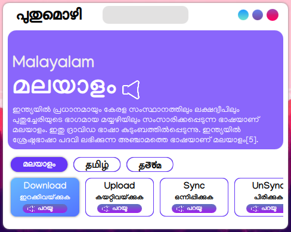
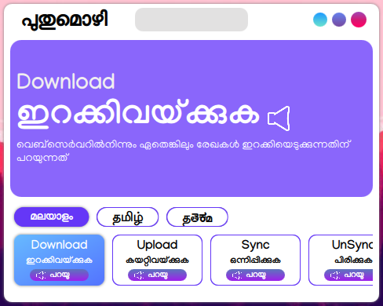

<h1 align=center style="">പൊതുമൊഴി</h1>

A glossory for malayalam technical terms which is based on modern malayalam(may be more understandable). Feel free to add new malayalam words and to improve our mother toungue.

 

We are trying to make this a glossory for dravidian languages by which we may localize technical terms to our native languages. Other than that a centralized language can also be made(we may call it NeoDravidian).Malayalam words added are taken from [പച്ചമലയാളം](https://archive.org/details/technical-words-in-malayalam) and [MalayalamLabs(സ്വതന്ത്ര മലയാളം കംപ്യൂട്ടിങ്)](https://community.smc.org.in/t/resources-for-translators/403). I am nothing more than a native Malayalam speaker(I don't have any qualifications of degree in that subject). This is My first attempt to make a github repository. So pardon me for  errors or for my bad programming language involved in it. Try to make it best. Who knows may be one day our native languages can  stand alone without depending on any others.

## Planned Features

 - Tamil Language support
 - Kannada Language support
 - Telugu language support
 - More Contributions to NeoDravidian

But for now Malayalam is the only supported language.

## Features on which we may work for next release

 - Text to speech implement.
 - Verification of current translation.

## Build Dependencies

 - ```qt5-default >=5.15```
 - ```qtquickcontrols >=2.12```
 - ```qtquickwindow >=2.15```
 - ```qtquick >=2.15```
 - ```qmake```
 - ```g++```
 - ```make```

## Installing

First clone github repository to whereever you want.
```git clone https://github.com/NewtronReal/pothumozhi.git```
and then navigate to your extracted source directory.
```cd pothumozhi```
Run qmake first
```qmake -project pothumozhi.pro```

Now it should have generated a make file in your folder.
```make && ./pothumozhi``` to run your application.

Alternatively you can also download the source and extract it. Make sure the dependencies are resolved by your system. Some of the features are exclusive to Qt 5.15 so ensure your qt version. Now you are good to go.
